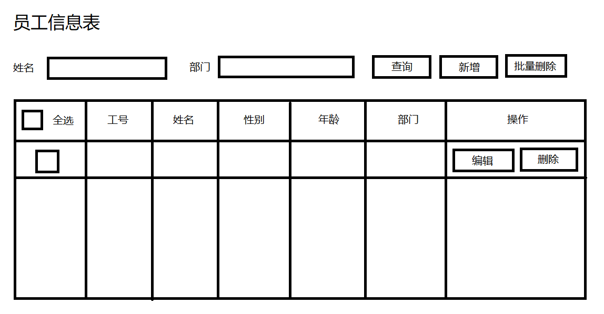
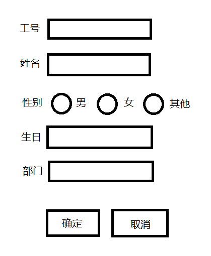

# 要求

制作如下页面

## 列表页:



其中姓名和部门作为查询字段用于筛选数据

姓名是模糊查询

部门是下拉选择

例如：姓名输入 `张` 部门选择 `IT部`

则应该筛选出来 `IT部中姓名包含张字` 的数据

只填姓名或部门 则只查询符合姓名或部门的数据

不填查询条件就相当于没有条件

## 添加和编辑页面



工号: 一个只读输入框，工号由系统自动生成一个递增的数字

生日: 一个日期选择输入框 年龄在列表页可以通过生日自动算出来

部门: 一个下拉选择

## 帮助

```js
// 数字格式的时间，代表当前系统时间
let now = Date.now()

// <input type="date"> 该类型输入框的value值是一个字符串 例如: 1999-10-12

// 获取输入框代表的日期的时间数字
let time = new Date(input.value).getTime()

// 计算时间差
// timespan 单位为毫秒
let timespan = now - time
```