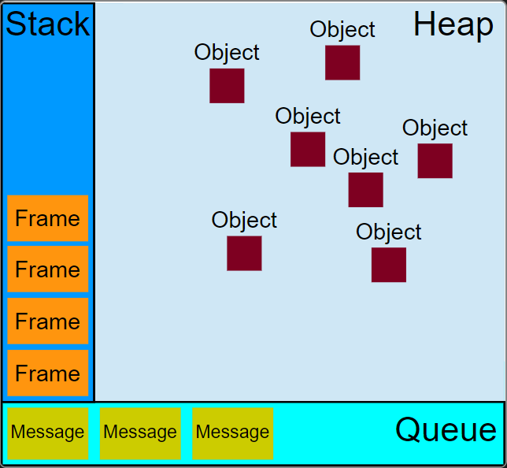
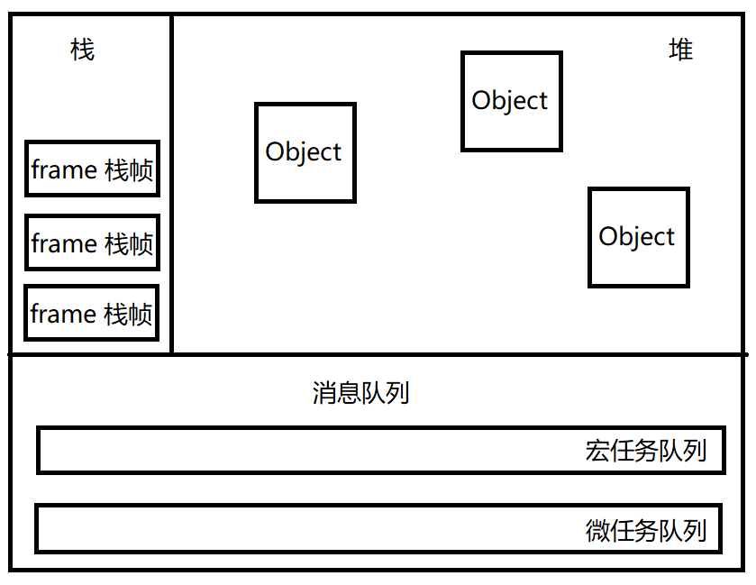

# js 运行原理

参考文献:

<https://developer.mozilla.org/zh-CN/docs/Web/API/HTML_DOM_API/Microtask_guide/In_depth>

<https://developer.mozilla.org/zh-CN/docs/Web/JavaScript/EventLoop>

<https://dmitripavlutin.com/javascript-promises-settimeout/>

## js 执行上下文(execution context)

执行js的内存区域

3种地方会创建执行上下文

1. 全局执行上下文: js程序一开始运行就创建的上下文 (页面 script 标签内的内容就是再全局执行上下文上运行的)
2. 函数执行上下文: 函数运行时会创建一个用于运行函数的执行上下文
3. eval(): eval() 函数调用时，其内部字符串被当作脚本执行时，会创建执行上下文

## js 运行时(runtime)

用来调度和维护任务，处理事件循环的地方，一个js运行时，包括以下几个部分

1. 执行上下文栈
2. 执行上下文堆
3. 消息队列
   1. 任务队列(宏任务队列)
   2. 微任务队列

可视化表达为:





### 事件循环

由js运行时处理的事件或其他任务，都会被加入到队列中，任务不断的被加入队列，从队列取出执行，又加入队列，又被取出执行的过程称为事件循环

类似如下代码:

```js
while(waitForMessage()) {
    processMessage()
}
```

> **注意:** 队列的执行顺序始终是 **先进先出**

#### 任务队列 (task queue)

也叫 **宏任务队列**

该队列中的任务将在一个事件循环周期开始时被调用

事件循环周期开始后，再被加入的任务，**将不会在这一个周期内被调用**

哪些方法可以创建宏任务呢？

例如: `setTimeout` 或 `setInterval` 创建的任务将被加入该队列

#### 微任务队列 (microtasks queue)

该队列中的微任务将在一个宏任务执行结束后，依次执行队列中的所有微任务

并且微任务队列没有执行完的情况下，**若再加入微任务，该微任务依然会被执行，微任务队列的执行直到队列中所有任务全部完成为止**

哪些方法可以创建微任务呢？

例如: `Promise` 的 `resolve` 函数调用时，会创建一个微任务