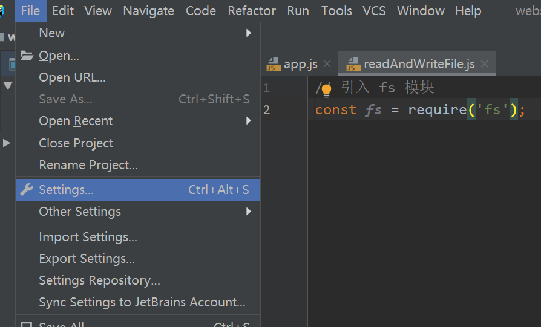
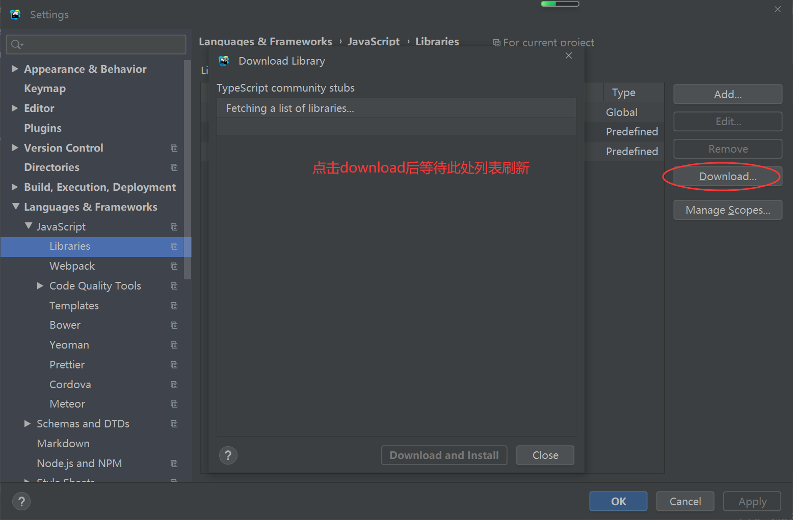
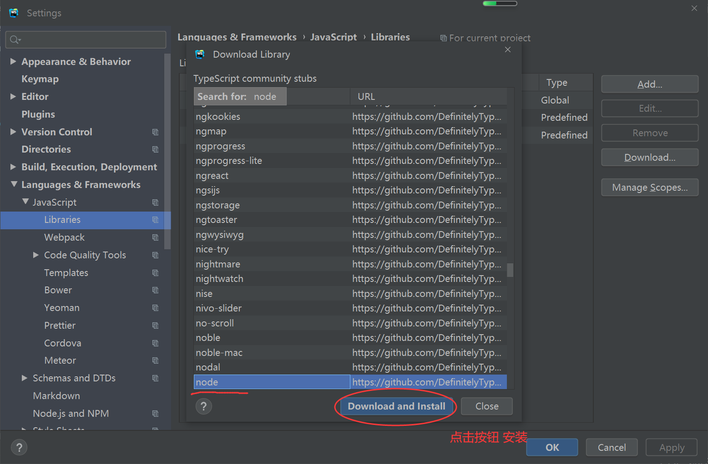
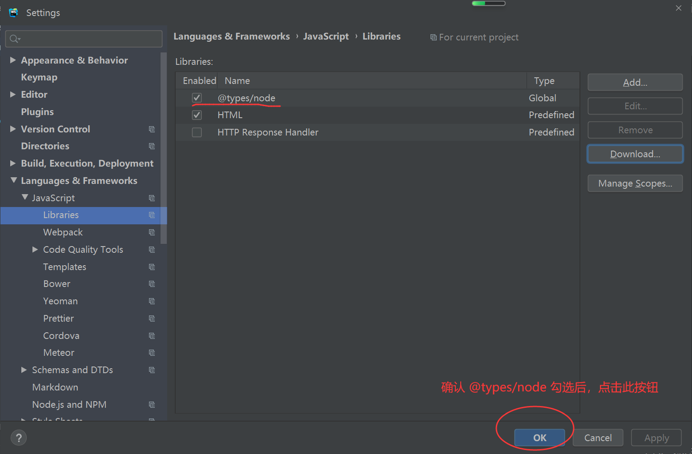

# 配置webstorm的nodejs代码提示
打开 file -> setting



找到 Languages -> javascript -> libaray

然后点击 download 等待列表刷新



然后在列表中选择 `node` 进行安装



安装好后，确认 `@tpyes/node` 已勾选，然后点击确定



至此node.js的代码提示功能就安装完成。

## 使用npm安装代码提示

打开终端，执行以下命令安装 @types/node

```
# 安装最新版本的代码提示
npm install -g @types/node

# 使用npm安装指定版本号的代码提示
# v代表的是版本号
npm install -g @types/node@v

# 卸载代码提示
npm uninstall -g @types/node
```

执行完命令后，查找 @types/node 安装路径
```batch
npm ls -g
# 输出结果如下
# C:\Program Files\nodejs -> .\
# ├── @vue/cli@5.0.4
# ├── create-react-app@5.0.1   
# ├── npm@8.1.2
# ├── sass@1.53.0
# └── yarn@1.22.19

# 输出结果的第一行路径中存在一个 node_modules 文件夹，里面就有 @types/node 文件夹
```

然后 手动配置 webstorm，打开 file -> setting -> language and framework -> javascript -> libraries

然后在右侧点击 add ，然后点击 右侧加号，选中 attach Directories，然后 填入 刚才下载的 node 路径，点击确定即可