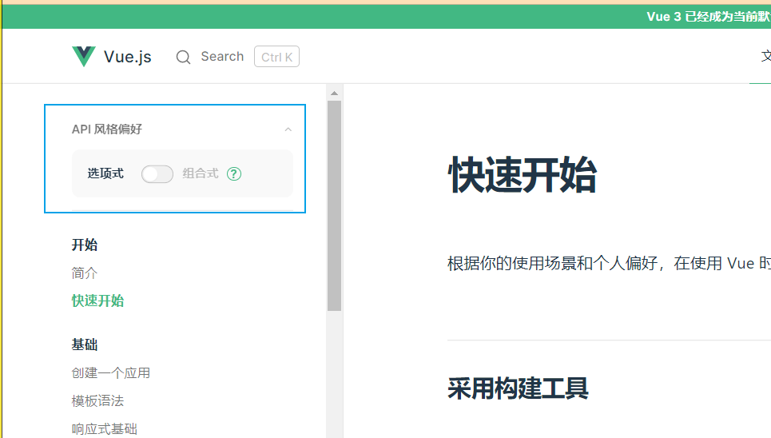
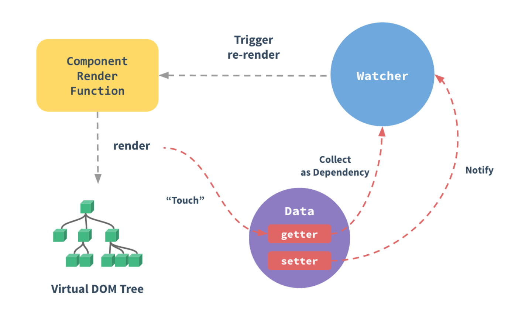

# vue简介

官网: <https://cn.vuejs.org/>

vue（读音类似view）是一个 **响应式** 的 **核心** 的js库

- 响应式：数据变化立即自动更新视图
- 核心的js库
  - 一切前端代码都是基于该核心完成的，类似于大楼的地基、汽车的底盘。
  - 基于核心能够衍生出很多生态。

## 如何查看文档？

文档有 vue2 和 vue3 版本，现在已 vue3 版本为主介绍

vue3 存在两个版本的文档，如图

选项式: 类似于 React 的类组件

组合式: 类似于 React 的函数组件

## 兼容性

Vue 不支持 IE8 及以下版本，因为 Vue 使用了 IE8 无法模拟的 ECMAScript 5 特性。但它支持所有兼容 ECMAScript 5 的浏览器。

## 响应式设计原理

受MVVM设计模式启发，并不完全遵照MVVM设计模式的设计

MVVM设计如下：

参与者:

- view: 视图层（页面）
- view model: 视图模型（控制层），是一个用于沟通 view 和 数据 model 的 桥梁，是一个用于控制的对象
- model: 数据模型

图中的箭头:

- 双箭头实线 databinding: view 页面发生数据变化会通知 viewmodel 更新数据；viewmodel 内数据发生改变会通知 view 更新视图
- viewmodel->model实线: 通过控制层能够修改model中的数据
- model->viewmodel虚线: model数据层为viewmodel提供数据

vue的响应式设计如下：

参与者:

- virtual dom tree(虚拟文档树)：vue会创建一个和页面文档树一摸一样的一组虚拟文档树存放在内存中
- Data的setter和getter：Data 是vue中的一个对象 它包含 getter 和 setter 访问器，本质上是两个方法，用于对数据进行访问和赋值
- watcher：观察者 监视器，当数据data的setter方法被调用时 或某个依赖数据被访问时 会通知它
- Component Render Function: 组件的渲染函数

参与者的关系描述:

- 虚拟文档书 -> Data: 页面需求数据或需要设置数据就访问 Data 中的 getter 或 setter
- Data -> watcher: data 通过 getter 收集有依赖的数据时或 通过 setter 修改数据时 会通知 watcher
- watcher -> Component render function: watcher 收到通知后 触发组件的渲染函数
- component render function -> 虚拟文档树: 重新渲染虚拟文档树
