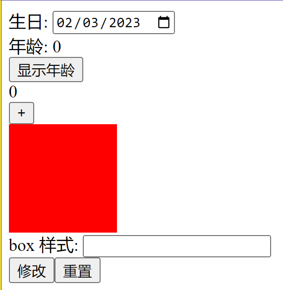

# 要求

使用 vue.js 完成下列要求

- 创建一个 `type="date"` 的输入框，用于输入生日
- 创建一个按钮叫做 `显示年龄`
- 创建一个 div，点击 `显示年龄` 后，将年龄显示到该 div 上
- 创建一个 `class="count"` 的 div，初始显示 0
- 创建一个按钮叫做 `+`
- 点击按钮 `+`，让 `class="count"` 的 div 中的数字自增
- 创建一个 `class="box"` 的 div
- 创建一个输入框用于修改 box 的样式
- 创建一个按钮叫做 `修改`
- 点击 `修改` 按钮 将样式赋值给 box
- 创建一个 `重置` 按钮
- 点击 `重置` 按钮，将 box 样式还原

示意图如下

