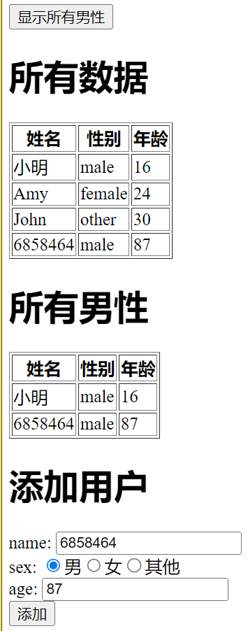

# 要求

使用 vuex 完成以下内容

1. 创建页面 Page1，在页面中创建输入框，输入内容并保存到 vuex 中
2. 创建页面 Page2，页面中显示 Page1 中输入的内容
3. 创建页面 users，页面显示一个用户表格数据包含 name sex age，数据存储到 store/user.js 下
    1. users 页面有个按钮，点击后表格将显示所有男性，请使用 getter来完成
    2. users 中添加一个录入数据的表单，用于添加数据到表格中

users 页面如下

> **注意:** 在点击按钮 `显示所有男性` 前，不显示 `所有男性` 下方的表格
> 当点击 `显示所有男性` 后，显示 `所有男性` 下方表格，并且添加用户若是男性，则自动更新表格数据