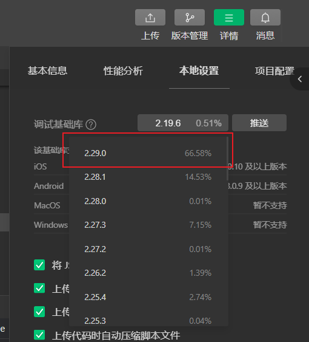

# 屏幕适配

## rpx

rpx 是 微信wxml中的长度单位，rpx 真实大小的计算是参考的 750px 的屏幕宽度进行的

1rpx 的物理大小 = 750px 宽度屏幕上 1px 的大小

单位的文档：https://developers.weixin.qq.com/miniprogram/dev/framework/view/wxss.html

### 总结

若希望某个元素再不同的机型下能够等比例缩放，则请使用 rpx 作为单位

若希望某个元素的大小再不同机型下保持不变，则请使用 px 作为单位

px的尺寸 = rpx下的尺寸 * (当前机型的屏幕宽 / 750)

rpx的尺寸 = px的尺寸 / (当前机型的屏幕宽 / 750)

## wx.getWindowInfo

> 注意: wx.getWindowInfo 这个方法需要在较高版本的微信开发框架下才能使用，请在下图中修改微信框架版本为最新或最多人使用的版本

### 作用

`wx.getWindowInfo` 的作用主要是用来查看设备屏幕的参数，例如: 导航栏高度，底部手势条高度等等。通过这个功能我们可以用来解决自定义导航栏或自定义底部选项卡被手机的状态栏或手势条遮挡的问题
